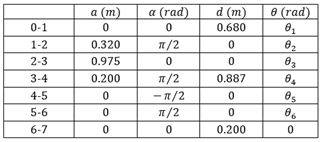
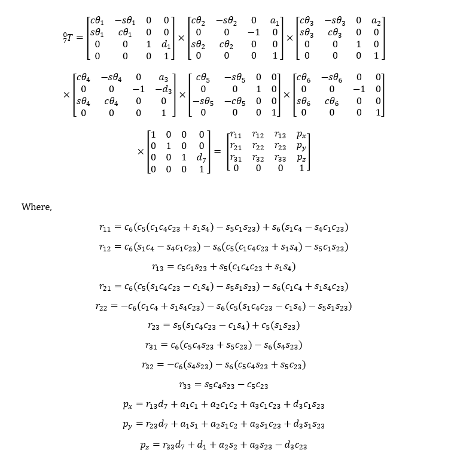
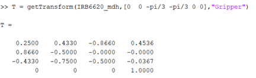
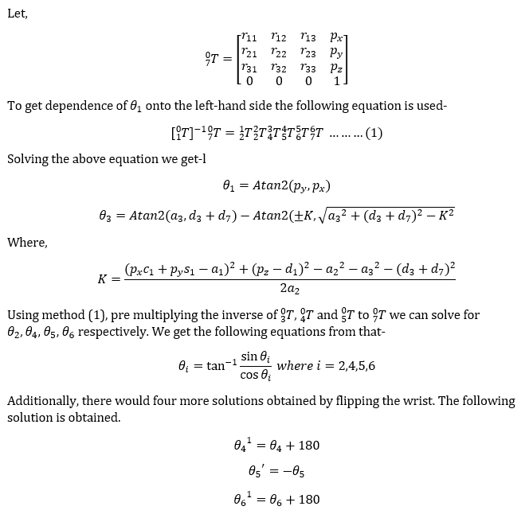
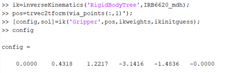
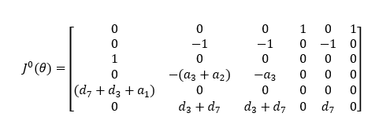
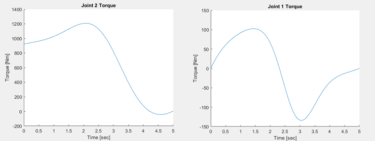
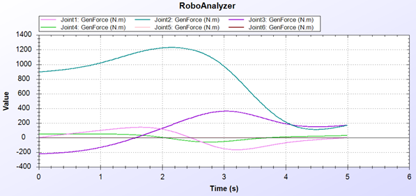

# Kinematic_Dynamic_Analysis_of_IRB6620

Kinematic and Dynamic analysis is the foundation of any robot. To perform the analysis detailed analytical approach validated with a numerical software approach of IRB 6620 is performed. The robotics Toolbox in MATLAB is used to create IRB 6620 Manipulator tree (IRB_6620_Model.m). The Manipulator model in MATLAB is is shown in the Fig.  

To create IRB 6620 using the Toolbox, the DH parameters from Table are used as inputs.

In the next section, Kinematic and Dynamic analysis of IRB 6620 is presented. 

## Kinematics

It is the science of motion that treats the subject without regard to the forces that cause it. There are two types of problems in kinematics. First one is Inverse Kinematics where given end effector pose, joint angles are calculated. Other is known as Forward Kinematics, where given the joint angles, the end effector orientation and position is calculated. 

### Forward Kinematics

We start with analytical equation of forward kinematics first as shown. 

To get the homogenous transformation matrix of frame relative to another frame in MATLAB getTransform() function is used. 

The homogenous matrix obtained by this software numerical approach yields the same result as that of the analytical approach. 

### Inverse Kinematics

For IRB 6620, both analytical as well as simulation software approaches are used. The algebraic solution of IRB 6620 is presented first. 

To perform Inverse Kinematics in MATLAB two functions can be used, inverseKinematics() and generalizedInverseKinematics(). generalizedInverseKinematics() is used when there are more constraints apart from pose of the end effector. The results obtained is shown in Fig.

## Static Velocity Analysis

Since manipulator is a chain of bodies, each one is capable of motion relative to its neighbor. Velocity of link i+1 will be addition of velocity of link i and velocity component added by joint i+1. While determining the motion of robot links, link frame 0 is taken as reference. For simplicity in the calculation, linear and angular velocity are calculated at [0 pi/2 0 0 0 0] joint values. Detailed calculation can be seen in the report. 

The jacobian matrix was calculated. The Jacobian Matrix (J) maps the differential velocities between joint space and cartesian space. For an N axis manipulator, the end effector cartesian velocity if shown in Fig. The Jacobian matrix is computed with respect to the base frame. geometricJacobian() function is used to calculate the Jacobian Matrix of IRB 6620. 

## Dynamic Analysis

Dynamic analysis deals with the study of motion equations, the way in which manipulator responds when torque is applied by the actuators or external forces. Usually, there are two problems related to the dynamics of the manipulator. First one is Inverse Dynamics where given trajectory points, joint torques are calculated. Other is known as Forward Dynamics, where given joint torques, the resulting motion of the manipulator is calculated. 

To perform inverse Dynamics in MATLAB, the mass properties, Centre of mass and Inertial Tensor have to entered into the Robot Tree. The mass of different links is shown in Table. In MATLAB inverseDynamics() function is used to calculate joint torque given θ,θ ̇ and θ ̈. The initial configuration of robot is taken [0 0 -60 -60 0 0] and final joint values are [120 90 60 120 90 60]. The following results are obtained using MATLAB. 

The torque is calculated for a quintic trajectory. Inverse Dynamics was also validated in RoboAnalyzer. RoboAnalyzer is an open source, 3D model-based software. To create IRB 6620, DH parameters are entered into the software. Changes were made in DH parameters according to the documentation of RoboAnalyzer. The results plotted are shown in Fig. Joint torque calculated by MATLAB yield the same result to that of RoboAnalyzer.  

## Conclusion

In the above project detailed analytical approach validated with a numerical software approach of IRB 6620 is presented. Complete graphical data is provided to ease the transparency of the process and improve the analysis readability. For numerical validation, MATLAB and RoboAnalyzer software are used. Hence a cross-domain approach to Kinematic and dynamic modelling and analysis of a robot is investigated with supporting graphical and numerical results.

