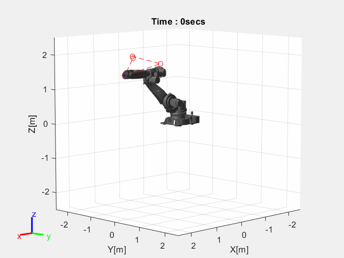
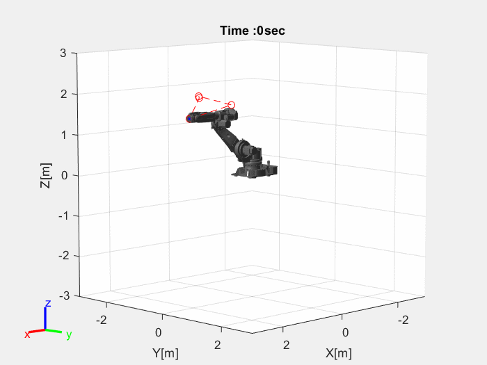
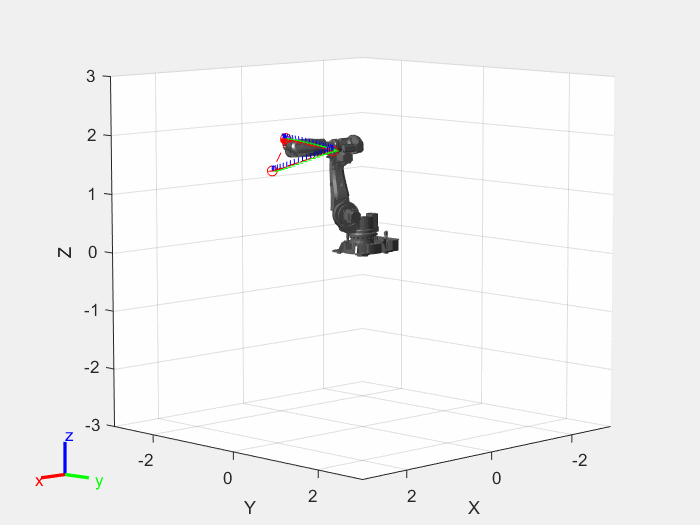

# Trajectory Planning of IRB 6620

In the above project, MATLAB scripts were created to study trajectory planning of a 6DOF Manipulator. 

Purpose of different MATLAB scripts are as follows-
* Create_Via_Points.m -- Generate via points and other data points for the simulation.    
* Task_vs_Joint_space.m -- Compares Task space and Joint space Trajectories with trapezoidal time scalings.                                                                            
* Trajectory_Joint_Space.m -- Generates and compares different types of trajectories in Joint Space (No ROTATION). 
* Trajectory_Task_Space.m -- Generates and compares different types of trajectories in Task Space (No ROTATION). 
* Trajectory_with_rotation.m -- Computes Task space trajectory with linear interpolation of Rotation Matrix.
* Trajectory_with_transform.m -- Computes Task Space trajectory with interpolation in Homogenous Matrix using different time scalings. 
* plot_trajectory.m -- Plots the trajectory along with speed and acceleration variation.  
* IRB.mat -- Contains the Robot Rigid Tree.
* IRBPosition.mat -- Important Joint and Tool Positions. 
* Trajectory Planning Report.pdf -- Comprehensive review of all the calculations done regarding Trajectory Planning. 

Using 'Task_vs_Joint_space.m', Trajectory in Joint space and Task space is compared. Path to Path trajectories are visualed, specifically straight line motion. As seen in the Figures, straight line motion in joint space doesnt guarantee straight line path in caartesian space. Comparison is shown in the figure below-

       
MATLAB has extensive list of functions that can be used to perform analysis of robotic systems. For this project, Functions like trapveltraj(), cubicpolytraj(),quinticpolytraj() were used for trapezoidal, cubic and quintic trajectories respectively.

## Joint Space Trajectory Planning:
 
Joint space planning method executes faster since Inverse Kinematics is only calculated at the via-points. Also, the actuator motion is smooth and easier to validate. But in joint space, intermediate points are not guaranteed to be collision free or respect joint limits.

Following results are obtained for IRB 6620 -

## Task Space Trajectory Planning:
 
In task space planning, Motion is predictable and offers better handling of obstacles and collisions. But the method is slower since Inverse Kinematics is calculated at every time step. Also, Actuator motion is not necessarily smooth.

Following results are obtained for IRB 6620 -

